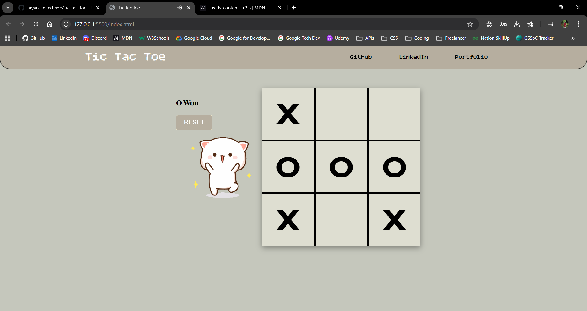

# 🎮 Tic-Tac-Toe

A classic, interactive Tic-Tac-Toe game built with modern web technologies. This project features a clean UI, smooth animations, and immersive sound effects for an engaging user experience.

> **Preview:**
> 

---

## ✨ Features

- **Interactive Gameplay:** Simple and intuitive click-to-play mechanics.
- **Dynamic Turn Tracking:** Real-time updates showing whose turn it is (X or O).
- **Win Detection:** Automatically detects winning combinations and draws a strike-through line.
- **Audio Experience:**
  - Background music for a pleasant atmosphere.
  - Interactive "Ting" sound for every move.
  - "Game Over" sound effect upon winning.
- **Visual Feedback:** Celebratory GIF animations appear when a player wins.
- **Responsive Design:** Fully optimized for different screen sizes (Desktop, Tablet, and Mobile).
- **Reset Functionality:** Quickly restart the game with a single click.

---

## 🚀 Technologies Used

- **HTML5:** Semantic structure for the game board and layout.
- **CSS3:** Custom styling, grid layout, and smooth CSS transitions.
- **JavaScript (ES6):** Core game logic, DOM manipulation, and event handling.
- **Google Fonts:** Utilizing premium typography like _Bitcount Grid Single_ and _Playfair Display_.

---

## 🛠️ Installation & Setup

1. **Clone the repository:**

   ```bash
   git clone https://github.com/aryan-anand-sde/Tic-Tac-Toe.git
   ```

2. **Navigate to the project directory:**

   ```bash
   cd Tic-Tac-Toe
   ```

3. **Open the game:**
   Simply open `index.html` in your preferred web browser.

---

## 👨‍💻 Author

### Aryan Anand

- [Portfolio](https://www.aryananand.me/)
- [LinkedIn](https://www.linkedin.com/in/aryan-anand-sde/)
- [GitHub](https://github.com/aryan-anand-sde)

---

## 📜 License

This project is open-source and available under the [MIT License](LICENSE).
